# Armo IV

Saca mucha data de _Modal Jazz Composition & Harmony I y II - Ron Miller_.

### Armonización diatónica

Es cambiar un acorde diatónico por otro de la misma función. Está bueno tener en cuenta tema de notas en común! Por ej. cualquier acorde Maj7 puede ser reemplazado por un m7 que esté una tercera menor por debajo.

Cualquiera de las primeras elecciones de rearmonización influye con el carácter de la pieza. Primero hay que descubrir cuales son los puntos de clímax de la pieza y trabajar eso. Una vez que decidís qué vas a poner ahí, vas anticipando cuál va a ser el caracter.

Dos conceptos importantes:

- Reemplazo de acorde.
- Acorde objetivo.

Con un acorde objetivo pasa algo similar a lo que pasa con una "cadencia", que dependiendo del contexto es un punto de descanso o de tensión.

Primera técnica para aproximar a un acorde objetivo: usar acordes diatónicos que mantengan constante la función que cumple la nota de la melodía en la armonía. Esto puede armarse con distintos grados de actividad, no hace falta un acorde por nota.

Los acordes con muchas notas en común no dan mucho contraste. Cuartas y segundas en el bajo hacen avanzar más a la progresión.

### Intercambio modal

Por ej, si queremos rearmonizar todo con acordes donde la nota de la melodía sea la novena, podemos usar acordes de intercambio modal para los que no tienen novena natural.

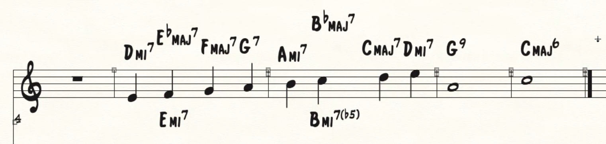

Podemos usar como acordes contrastantes los que tengan movimiento de bajo de segunda o cuarta, ascendente o descendente.

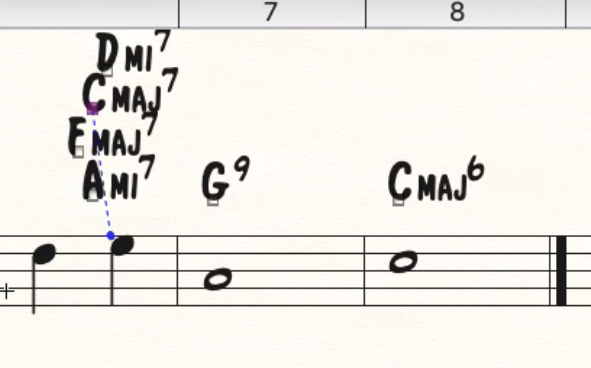

Podés elegir un acorde que te gustó como queda y, yendo para atrás, elegir acordes en los que las notas de la melodía tengan la misma función que la nota de la melodía en ese acorde.

Podés usar intercambio modal para que no te queden tritonos hasta que llegue la quinta. Por ej, en vez de Bm7^(b5)^, BbMaj7.

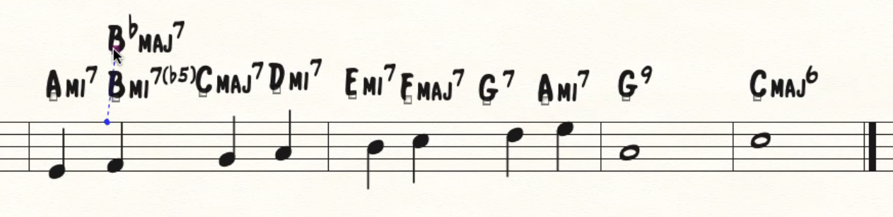

3 formas para incluir un acorde de intercambio modal:

1. Cambiar un acorde diatónico por un acorde de intercambio modal de la misma función. Ejemplo, poner un subdominante menor.
2. Usar acordes de intercambio modal como acordes de aproximación.
3. Usar acordes de intercambio modal para reemplazar un acorde de distinta función. Ej, poner un subdominante menor en vez de un V.

Podemos cambiar acordes cadenciales diatónicos por cadenciales modales.

### Cadena de dominantes

Podemos usar una cadena de dominantes para aproximar al acorde objetivo. Es un recurso aplicable a cualquier melodía a un acorde por nota.

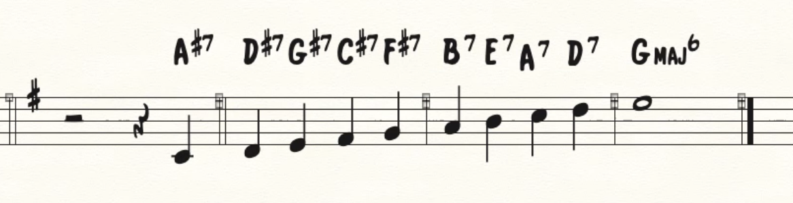

- El C#7 puede ser cambiado por un C#7sus4.
- El D#7 por un A7sus4, que está a distancia de tritono.

Los que tienen tensiones alteradas suenan más duros. En este ejemplo suenan raro porque van en contra de la resolución que se espera de las tensiones alteradas (descendentes).

El recurso para suavizar esto es otra vez la sustitución, porque **todo lo que es alterado de un lado del tritono es natural del otro**. Tensiones alteradas en un acorde son tensiones naturales en el sustituto tritonal de ese acorde.

Podés usar los segundos relativos.

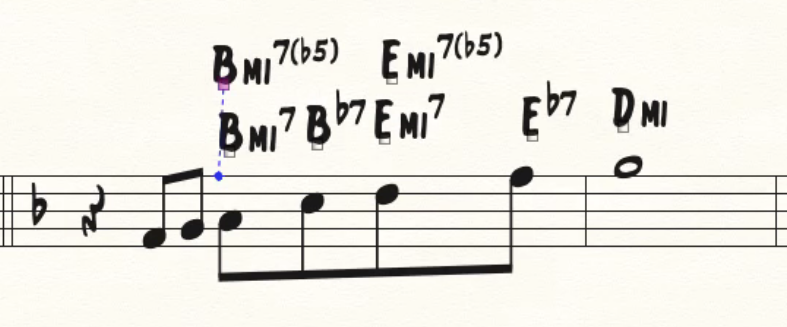

Entonces, para dominantes:

- Si te tocó la cuarta, SUS4.
- Séptima mayor, sustituto versión SUS4.
- Priorizar quinta o tensiones naturales por sobre tensiones alteradas.
- Cuando te toca una nota guía da lo mismo, cuando te toca tónica u oncena aumentada también.

### Spreads A 5 voces

1. Melodía.
2. Tensión.
3. Nota guía.
4. Nota guía.
5. Tónica.

- Entre bajo y primera nota guía los intervalos habituales son tercera, séptima o décima.
- Normalmente las tensiones van en la melodía o la segunda voz, eventualmente entre las notas guía...

**LIL** = Low Interval Limit. Abajo del Re de la mitad de la clave de Fa no pongas nada que no sea tónica o quinta (o bajo si es inversión).

Cuando tenés un II V cualquiera de los dos acordes puede ser el objetivo, porque un II V es una elaboración del V.

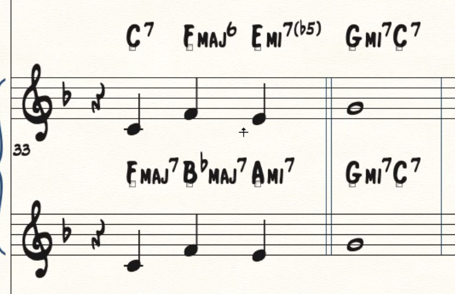

En el primer caso apunta al G-7 y usa todos acordes cuya tónica es la nota de la melodía. En el segundo ejemplo le apunta al C7 y usa todos acordes cuya quinta es la nota de la melodía.

Otra técnica: pensar en el compás y elegir acorde que genere movimiento resolutivo, fuerte de fundamentales (cuarta o segunda) hacia cualquiera de los acordes del II V.

Vos podés decidir en qué momento empezás intensificar.

### Híbridos y poliacordes

En un híbrido el bajo es la tónica, a diferencia de lo que pasa en una inversión.

Cuando tenés acordes de séptima podés tener algún tipo de duplicación. Las notas que no tenés que duplicar son la tónica y la tercera. Ejemplo en Do lidio:

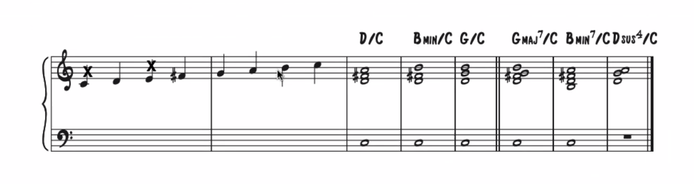

Con la nota no disponible depende del contexto. Si estás armonizando un tema tonal en el cual un Cm7 dorico funciona como II, no la usás.

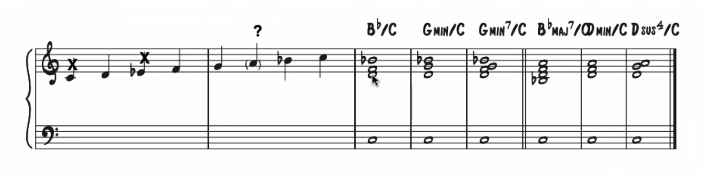

Suena bien que la nota de la melodía (sobre todo si es larga) esté en la estructura superior al momento que ataca el acorde.

Una vez que definís sobre qué escala vas a trabajar, cualquier estructura que puedas cifrar como tríada o séptima que incluya por lo menos una tensión es utilizable como una capa.

Los híbridos más populares tienen como estructura superior una tríada.

Los poliacordes son muy usados en dominantes. Hay que descartar los que tienen la cuarta justa o la septima mayor del dominante para la capa superior. Si tenés un poliacorde donde la quinta de un acorde entra en conflicto con el otro acorde, podés volarla.

Los híbridos y poliacordes se analizan desde el bajo. Por ej, si tiene un bajo en C, lo analizas desde el punto de vista de que es un C.

No dejarse llevar por el cifrado, no se trata de dos acordes o un acorde sobre un bajo random, es un solo acorde con tensiones.

### Estructuras constantes

Un elemento que ayuda a combinarlas es algún tipo de patrón constante/secuenciado entre fundamentales.

Las más usadas son las estructuras que pueden funcionar como tónica o punto de descanso, por eso Maj7, m7 funcionan bien. Pero esto también engancha bien con las estructuras híbridas.

Cualquier progresión de tres acordes que no remita a ninguna tonalidad funciona como estructuras constantes.

Técnicas para lograr estructuras constantes:

1. Sustituir un acorde por un acorde de función similar. Pensar en las notas en común también (por ej, CMaj7 y A-7).
2. Change the chord quality from the original harmonization to match that of the series.
3. Introduce additional passing or approach chords.
4. Eliminate from the original harmonization chords which have a different quality than your reharmonization.

### Resumen

**Conceptos importantes:**

- Armonización diatónica: cambiar acorde diatónico por otro de la misma función.
  - Reemplazo de acorde.
  - Acorde objetivo.

**Técnicas:**

1. Aproximar con acordes diatónicos en los cuales la nota de la melodía cumple la misma función
2. Acordes de intercambio modal para los que tienen tensión no disponible.
3. Aproximar con cadena de dominantes. Podés usar los segundos relativos.
4. Acordes de intercambio modal:
   - Cambiar un acorde diatónico por uno de intercambio modal de la misma función.
   - Usar acordes de intercambio modal como acordes de aproximación.
   - Usar un acorde de intercambio modal reemplazando a uno diatónico de distinta función.

**Híbridos:**

- El bajo es la tónica.
- No duplicar tercera ni tónica.
- Cuando definís con qué escala vas a trabajar, cualquier tríada o séptima que incluya al menos una tensión es utilizable como capa.

**Poliacordes:**

- Muy usados como dominantes.
- Descartar los que tienen cuarta justa o séptima mayor del dominante en la capa superior.
- Si la quinta de un acorde entra en conflicto con la del otro acorde, podes sacarla.

**Estructuras constantes:**

- Siguen un patrón constante/secuenciado entre fundamentales.
- Se usan las estructuras que sirven de descanso, como Maj7 o m7.
- Cualquier progresión de tres acordes que no remita a ninguna tonalidad puede funcionar como estructuras constantes.

### Escalas Madre y sus Modos Derivados

Pensar cada colección de notas como fuente de material para que construyamos las estructuras verticales que vamos a ver con qué tipo de técnica las conectamos. Trabajamos los voicings de los acordes en un sistema de capas donde vamos a tener una estructura sobre un bajo.

Hay una tabla de prioridad de notas a modo de sugerencia para construir un acorde (voicing) que refleje ese modo. La primera nota (soprano) siempre es la nota característica. Casi siempre las notas 2 y 3 son las notas guía.

Hay cifrados que representen precisamente el voicing que estamos haciendo. Por ej, Bsus4/C sería un C lidio.

**Estructura comodín:** estructura superior común para acordes derivados de la misma escala madre.

En un acorde de tónica en armonía modal no hay notas no disponibles.

Otras escalas que usamos como puente son la menor melódica, menor armónica, mayor artificial.

Hay "paletas" al final del material que dejó el Pollo. Son una colección de colores que podemos usar. La paleta 1 es la combinación de los modos derivados de jónico y menor melódica. El orden en el que están puestos supuestamente es el orden de brillo, de más brillante a más oscuro. Mayor > menor y nota aumentada > nota descendida.

Hay "grupos", que van en orden de estabilidad. Los del grupo 1 pueden ser usados como tónica.

Hay otro apunte, "Formas de Organización de Progresiones Modales". Tiene que ver con convenciones sobre distintos tipos de sonoridades que vamos a dar a progesiones basadas en tres elementos:

- Pulso armónico.
- Claridad del centro tonal.
- Importancia estructural de la línea de bajo.

|                                             | Modal Lineal                                                                                       | Mesetas Modales                                                                               | Modal Vertical                                   |
| ------------------------------------------- | -------------------------------------------------------------------------------------------------- | --------------------------------------------------------------------------------------------- | ------------------------------------------------ |
| Pulso armónico                              | 1. Nulo (un acorde / modo / pedal).  2. Lento (un acorde por compás o más)     Regular | Suficientemente lento como para establecer una "modalidad" por acorde     Regular     | Rápido a muy rápido. Tiende a ser más irregular. |
| Claridad del centro tonal                   | Muy claro. Mayoritariamente armonía diatónica y/o I mayor.                                         | Coyuntural.  Clarísimo dentro de cada meseta.  Poca relación diatónica entre mesetas. | Poco clara.                                      |
| Importancia estructural de la línea de bajo | Relativa.                                                                                          | Importante para organizar la relación entre mesetas.                                          | Fundamental.                                     |

Hacer un tema "modal lineal" o "mesetas modales" con uno o dos compases de "modal vertical" para volver a otro lado garpa. Tipo una sección cadencial.

Cuando hay un acorde Maj7 con 5ta aumentada como estructura superior lo más probable es que termine siendo un modo de menor melódica.

Ejemplo: en Naima se va pudriendo a medida que se acerca a la resolución. Va poniendo más tensiones alteradas y acelera el rítmo armónico antes de llegar a la resolución.

Un acorde Maj7^(b5)^ lo pensamos como el IV de la escala madre de la cual viene el modo.

### Armonía cuartal

Dos estructuras cuartales según la cantidad de semitonos entre intervalos:

- 6/5
- 5/6

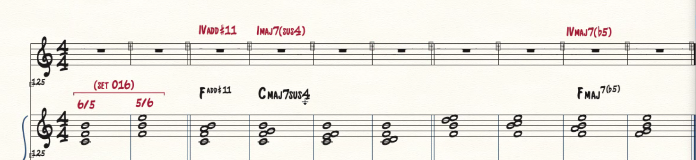

Vamos a empezar a ver progresiones que usan técnicas parecidas a las que vimos en Naima, donde la construcción de la progresión está basada en estructuras sobre un pedal.

Hay categorías de conexión de acordes. A partir de un voicing podemos definir una armonía, en vez de tener primero la armonía y después el voicing.

Él usa un híbrido entre dos cuestiones, pensar verticalmente y pensar la conducción de voces.

En una conexión de acordes:

- **Punto Focal Común** (elemento que se mantiene constante a lo largo de todos los acordes de una progresión).
  - Soprano común.
  - Bajo común.
  - Estructuras internas comunes.
  - Estructuras superiores constantes:
    - Misma estructura superior, bajo que cambia.
    - Estructura superior constante, bajo pedal.
    - Manipulación melódica de estructura superior y bajo.
- **Diseño artificial de contorno**
  - Contraste modal/relación brillo-oscuridad.
  - Deseo de resolución a jónico (paralelo o relativo).
  - Resolución paródica de sensibles.
  - Cadencias:
    - Paródica (parodia a una situación tonal).
    - Críptica. (?)
- **Manipulación melódica**
  - Diseño de soprano.
  - Diseño de bajo.
  - Patrones reconocibles. (?)
  - Efectos melódicos. (?)

### Clusters

Los clusters son voicing por segundas. No conviene pasarse del centro del pentagrama en clave de sol. Ponés la nota que querés y mandás segundas.

Se puede hacer voicings que no necesariamente sean todas segundas pero que funcionen de forma parecida.

### Voicings mixtos

Los voicings mixtos son los más balanceados. En todos los voicings las 4 primeras notas de la tabla que dio se pueden agrupar como un voicing mixto.

Nota: la novena aumentada suena a novena aumentada siempre que pongas también la tercera mayor.

Podés hacer progresiones donde el brillo aumente o disminuya usando el orden de brillo que vimos.

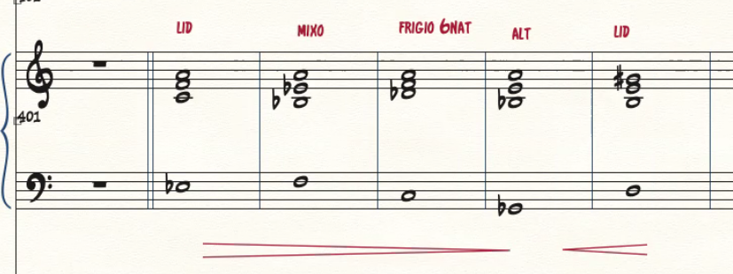

Guante: sale del libro de Miller, es un tipo de forma que es como un "comodín" para ciertas situaciones. Por ej, pueden servir para todos los modos de jónico como escala madre, otros para los modos de eólico como escala madre. Son estructuras mixtas en jónico, por terceras en menor melódica.

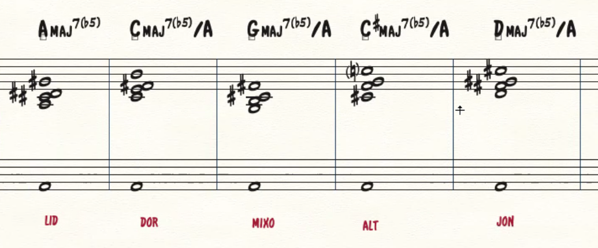

Estructuras internas comunes.

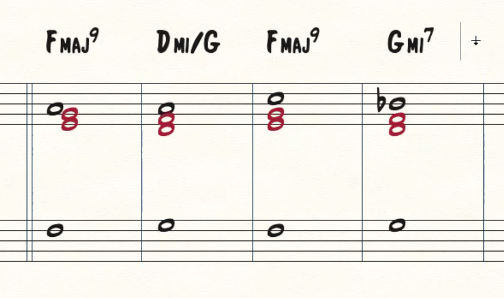

Final:

- [ ] Composición libre, usar todo.
- [ ] Ser muy específico con los voicings, sea cual sea el/los instrumentos con los cuales armamos los acordes.
- [ ] Para clusters pide todas segundas.
